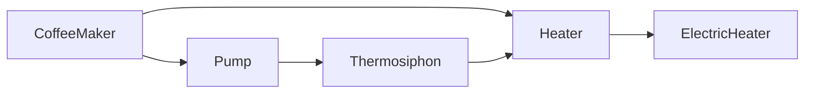

# swift-blade

Swift-blade is a [macro](https://docs.swift.org/swift-book/documentation/the-swift-programming-language/macros/) powered dependency injection framework for Swift.

It is heavily inspired by [Dagger](https://dagger.dev/).

## Installation

### Swift Package Manager

Declare swift-blade as a dependency in your `Package.swift` file:

```swift
.package(url: "https://github.com/shackley/swift-blade", from: "0.1.0")
```

Add Blade as a dependency to your target(s):

```swift
.product(name: "Blade", package: "swift-blade")
```

## Usage

We’ll demonstrate dependency injection with swift-blade by building a coffee maker. For complete sample code that you can compile a run, see [swift-blade-example](https://github.com/shackley/swift-blade-example).

### Declaring Dependencies

Swift-blade takes care of initializing instances of your application's classes and providing their dependencies.

Adding the `@Provider` attribute to an initializer will allow swift-blade to provide instances of the class within an application's dependency graph. The parameters of the class's initializer are its dependencies. When a new instance of that class is needed, swift-blade will obtain the required parameters values and initialize the class.

```swift
class Thermosiphon: Pump {
    private let heater: Heater

    @Provider(of: Thermosiphon.self)
    init(heater: Heater) {
        self.heater = heater
    }

  ...
}
```

> [!NOTE]
> An initializer-based `@Provider` must have its return type specified via the `@Provider` attribute's `of` parameter.

```swift
class CoffeeMaker {
    private let heater: Heater
    private let pump: Pump

    @Provider(of: CoffeeMaker.self)
    init(heater: Heater, pump: Pump) {
        self.heater = heater
        self.pump = pump
    }

    ...
}
```

### Satisfying Dependencies

By default, swift-blade satisfies each dependency by initializing an instance of the requested type as described above.

But initializer-based `@Provider`s can't be used everywhere:
- Protocols can’t be initialized.
- Third-party library classes can’t be annotated.

For these cases, use a static `@Provider` function to define how a dependency should be satisfied. The function’s return type defines which dependency it satisfies.

For example, `provideHeater()` is invoked whenever a `Heater` is needed:

```swift
@Provider
static func provideHeater() -> Heater {
    ElectricHeater()
}
```

It’s also possible for static `@Provider` functions to have dependencies of their own. For example, since `Thermosiphon` has an initializer-based `@Provider`, the provider for `Pump` could be written as:

```swift
@Provider
static func providePump(pump: Thermosiphon) -> Pump {
    pump
}
```

This way swift-blade takes care of initializing `Thermosiphon`, and the static `@Provider` function is only used to alias it to the type `Pump`.

Finally, all `@Provider`s must belong to a module. These are just empty enums that have the `@Module` attribute. Modules must declare the classes that have initializer-based `@Provider`s via the `@Module` attribute's `providers` parameter. Static `@Provider`s are embedded directly within a module.

```swift
@Module(provides: [CoffeeMaker.self, Thermosiphon.self])
public enum CoffeeModule {
    @Provider
    static func provideHeater() -> Heater {
        ElectricHeater()
    }

    @Provider
    static func providePump(pump: Thermosiphon) -> Pump {
        pump
    }
}
```

### Building the Graph

The provider functions form a graph of objects, linked by their dependencies.



Calling code like an application’s `@main` function accesses that graph via a well-defined set of roots. That set is defined via a protocol with functions that have no arguments and return the root types. By applying the `@Component` attribute to such a protocol and declaring the modules that can used to obtain instances of dependencies, swift-blade then fully generates an implementation of that protocol.

```swift
@Component(modules = [CoffeeModule.self])
protocol CoffeeShop {
    func maker() -> CoffeeMaker
}
```

The implementation has the same name as the interface prefixed with "Blade". Now, our `CoffeeApp` can simply use the generated implementation of `CoffeeShop` to get a fully dependency-injected `CoffeeMaker`.

```swift
@main
struct CoffeeApp {
    static func main() {
        let coffeeShop = BladeCoffeeShop()
        coffeeShop.maker().brew()
    }
}
```

### Singletons

By default swift-blade will initialize a new instance of a dependency each time it is requested. Setting an `@Provider`s `scope` to `.singleton` will limit the dependency to a single instance that is shared within a component.

```swift
@Provider(scope: .singleton)
static func provideHeater() -> Heater {
    ElectricHeater()
}
```

### Lazy Dependencies

It may be beneficial to delay the initialization of some objects in the graph. Any dependency of type `T` can be substituted with a `Lazy<T>`. The object won't be initialized until the `Lazy<T>`'s `get()` function is called. Subsequent calls to `get()` will return the same underlying instance of `T`.

```swift
class GrindingCoffeeMaker {
    private let grinder: Lazy<Grinder>

    @Provider(of: GrindingCoffeeMaker.self)
    init(grinder: Lazy<Grinder>) {
        self.grinder = grinder
    }

    func grind() {
        // Grinder created once on first call to .get() and cached.
        grinder.get().grind()
        grinder.get().grind()
    }
}
```

### Named Dependencies

Sometimes the type alone is insufficient to identify a dependency. For example, a sophisticated coffee maker may want separate heaters for water and for milk. In these cases, dependencies of the same type can be distinguished by adding the `@Named` attribute to the parameter of a `@Provider` function or initializer.

```swift
class DualBoilerCoffeeMaker {
    private let waterHeater: Heater
    private let milkHeater: Heater

    @Provider(of: DualBoilerCoffeeMaker.self)
    init(
        @Named("water") waterHeater: Heater,
        @Named("milk") milkHeater: Heater
    ) {
        self.waterHeater = waterHeater
        self.milkHeater = milkHeater
    }

    ...
}
```

Named dependencies are provided by their corresponding `named` `@Provider`. Only static function providers can be named.

```swift
@Module(provides: [CoffeeMaker.self])
public enum CoffeeModule {
    @Provider(named: "water")
    static func provideWaterHeater() -> Heater {
        ElectricHeater(temperature: 212.0)
    }

    @Provider(named: "milk")
    static func provideMilkHeater() -> Heater {
        ElectricHeater(temperature: 140.0)
    }
}
```

### Binding Instances

You may have some instances already available at the time that you're initializing a component. You can add these instances directly to your application's dependency graph by defining an initializer for your component that includes parameters for the instances you wish to bind.

```swift
struct Configuration { ... }

@Component(modules = [CoffeeModule.self])
protocol CoffeeShop {
    init(configuration: Configuration)
    func maker() -> CoffeeMaker
}
```

The values passed into the initializer can then be automatically provided as dependencies to any object within thhe graph.

```swift
func run(with configuration: Configuration) {
    let coffeeShop = BladeCoffeeShop(configuration: Configuration)
    coffeeShop.maker().brew()
}
```

## Frequently Asked Questions

**Q: How is the dependency graph validated?**

Unlike Dagger, a Blade component's dependency graph is validated at runtime immediately upon component initialization. If a dependency does not have a registered provider, a `fatalError` will occur. This is largely due to the fact that the current [macro](https://docs.swift.org/swift-book/documentation/the-swift-programming-language/macros/) implementation does not have context APIs that allow a macro to glean semantic information about types found in a delcaration at the time of expansion. If such an APIs were to be added, this validation could potentially occurr at compile time.

**Q: Why do `@Provider`s attached to initializers have to specify their provided type?**

Currently, swift macros are not provided with any lexical scope information at the time of expansion, so it isn't possible for a `@Provider` macro to know which type the initializer belongs to otherwise.
