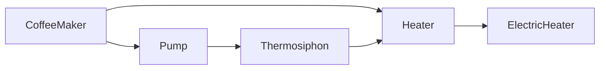

# swift-blade

[](https://swiftpackageindex.com/shackley/swift-blade)
[](https://swiftpackageindex.com/shackley/swift-blade)

Swift-blade is a [macro](https://docs.swift.org/swift-book/documentation/the-swift-programming-language/macros/) powered dependency injection framework for Swift.

It is heavily inspired by [Dagger](https://dagger.dev/).

## References

[API Documentation](https://shackley.io/swift-blade/documentation/blade/)

## Installation

### Swift Package Manager

Declare swift-blade as a dependency in your `Package.swift` file:

```swift
.package(url: "https://github.com/shackley/swift-blade", from: "0.1.5")
```

Add Blade as a dependency to your target(s):

```swift
dependencies: [
    .product(name: "Blade", package: "swift-blade")
]
```

## Example

We’ll demonstrate dependency injection with swift-blade by building a simple coffee maker. For complete sample code that you can compile and run, see [swift-blade-example](https://github.com/shackley/swift-blade-example).

### Defining Types

We'll start by defining a few types for our coffee maker.

Swift-blade utilizes initializers for dependency injection, so we'll start by writing our classes just like we would if we weren't using a dependency injection framework.

```swift
protocol Heater {}

protocol Pump {}

class ElectricHeater: Heater {
    init() {}
}

class Thermosiphon: Pump {
    private let heater: Heater

    init(heater: Heater) {
        self.heater = heater
    }
}

class CoffeeMaker {
    private let heater: Heater
    private let pump: Pump

    init(heater: Heater, pump: Pump) {
        self.heater = heater
        self.pump = pump
    }
}
```

### Declaring Providers

Swift-blade takes care of initializing instances of your application's classes and providing their dependencies.

In order to do so, swift-blade must be told how to obtain instances of each type that it encounters. This is where the `@Provider` attribute comes in.

Let's go back in and add the `@Provider` attribute to the initializers of our classes so that swift-blade knows how to obtain instances of them.”

```swift
class ElectricHeater: Heater {
    @Provider
    init() {}
}

class Thermosiphon: Pump {
    private let heater: Heater

    @Provider
    init(heater: Heater) {
        self.heater = heater
    }
}

class CoffeeMaker {
    private let heater: Heater
    private let pump: Pump

    @Provider
    init(heater: Heater, pump: Pump) {
        self.heater = heater
        self.pump = pump
    }
}
```

Now swift-blade can obtain instances of type `ElectricHeater`, `Thermosiphon`, and `CoffeeMaker`. However, it doesn't know how to satisfy dependencies of type `Heater` and `Pump` yet.

Since `Heater` and `Pump` are protocol types that can't be directly initialized, we'll define static `@Provider` functions that declare how dependencies of these types should be satisfied.

Static `@Provider` functions can have dependencies of their own. Since swift-blade knows how to obtain instances of type `ElectricHeater` and `Thermosiphon`, the providers for `Heater` and `Pump` can be written as:

```swift
@Provider
static func provideHeater(heater: ElectricHeater) -> Heater {
    heater
}

@Provider
static func providePump(pump: Thermosiphon) -> Pump {
    pump
}
```

This pattern is commonly used to alias a concrete type to a protocol that it conforms to.

### Creating a Module

All providers must be registered to a module. Modules are just empty enums that have the `@Module` attribute.

Initializer-based `@Provider`s are included in a module by specifying the provided type via the `@Module` attribute's `provides` parameter.

Static `@Provider`s are embedded directly within a module.

```swift
@Module(provides: [ElectricHeater.self, Thermosiphon.self, CoffeeMaker.self])
public enum CoffeeModule {
    @Provider
    static func provideHeater(heater: ElectricHeater) -> Heater {
        heater
    }

    @Provider
    static func providePump(pump: Thermosiphon) -> Pump {
        pump
    }
}
```

### Building the Graph

The provider functions form a graph of types, linked by their dependencies.



To construct and access the graph, we'll first need to define its roots. That set is defined via a protocol with functions that have no arguments and return the root types.

By applying the `@Component` attribute the protocol and declaring the modules that can used to provide dependencies, swift-blade then fully generates an implementation of the protocol.

```swift
@Component(modules = [CoffeeModule.self])
protocol CoffeeShop {
    func maker() -> CoffeeMaker
}
```

The implementation has the same name as the protocol prefixed with "Blade". Now, our `CoffeeApp` can simply use the generated implementation of `CoffeeShop` to get a fully dependency-injected `CoffeeMaker`!

```swift
@main
struct CoffeeApp {
    static func main() {
        let coffeeShop = BladeCoffeeShop()
        let coffeeMaker = coffeeShop.maker()
    }
}
```

## Advanced Usage

See [API Documentation](https://shackley.io/swift-blade/documentation/blade/) for advanced usage.

## Frequently Asked Questions

**Q: How is the dependency graph validated?**

Unlike Dagger, a Blade component's dependency graph is validated at runtime immediately upon component initialization. If a dependency does not have a registered provider, a `fatalError` will occur. This is largely due to the fact that the current [macro](https://docs.swift.org/swift-book/documentation/the-swift-programming-language/macros/) implementation does not have context APIs that allow a macro to glean semantic information about types found in a delcaration at the time of expansion. If such an APIs were to be added, this validation could potentially occurr at compile time.
